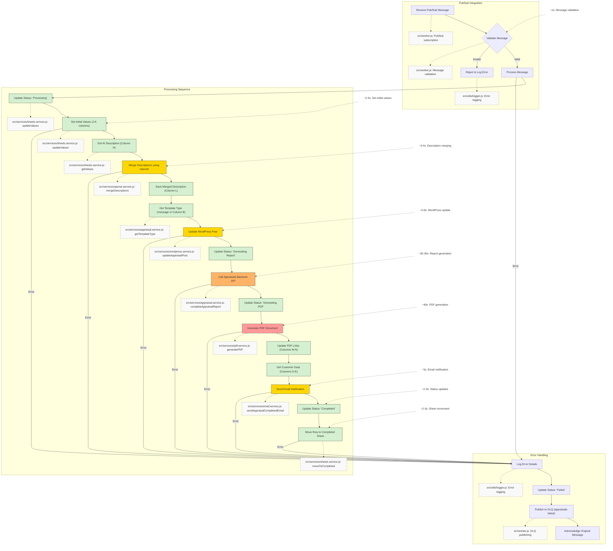

# Appraisers Task Queue Service

A microservice that processes appraisal tasks from Google Cloud Pub/Sub and updates Google Sheets.

## Project Structure

```
src/
  ├─ app.js              # Express server and service initialization
  ├─ worker.js           # PubSub worker and task processing
  ├─ services/           # Business logic services
  │   ├─ appraisal.js   # Core appraisal processing logic
  │   ├─ sheets.js      # Google Sheets operations
  │   ├─ wordpress.js   # WordPress integration
  │   ├─ openai.js      # AI text processing
  │   ├─ email.js       # Email notifications
  │   └─ pdf.js         # PDF generation
  └─ utils/
      ├─ logger.js      # Logging utility
      └─ secrets.js     # Secret Manager integration
```

## Features

- Listens for appraisal completion messages from Pub/Sub
- Updates appraisal status in Google Sheets
- Handles failed messages with Dead Letter Queue
- Health check endpoint
- Graceful shutdown
- Secure secret management using Google Cloud Secret Manager

## Detailed Process Flow

### Appraisal Processing Workflow



### Process Steps in Detail

When a new message is received from Pub/Sub, the following steps are executed in sequence:

0. **Message Validation and Type Processing** (~1s)
   - Validate message format and required fields
   - Extract appraisal type if provided in message
   - Validate appraisal type against allowed values: Regular, IRS, Insurance

1. **Set Initial Values** (~2-3s)
   ```javascript
   // Updates value and original description in Columns J-K
   await sheetsService.updateValues(`J${id}:K${id}`, [[value, description]]);
   ```

2. **Merge Descriptions** (~3-4s)
   - Get IA description from Column H
   - Merge with appraiser description using OpenAI
   - Limited to 200 words for WordPress title compatibility
   - Uses GPT-4 with specific prompt for concise merging
   - Saves merged description to Column L

3. **Get Template Type** (~1-2s)
   - If message contains valid appraisal type (Regular, IRS, Insurance), use it
   - Otherwise, retrieve type from Column B of spreadsheet
   - Validate spreadsheet type against allowed values
   - Default to "Regular" if type is invalid or missing
   - Log source of appraisal type (message or spreadsheet)

4. **Update WordPress Post** (~5-6s)
   ```javascript
   // Get existing post
   const post = await wordpressService.getPost(postId);
   
   // Update with merged description as title
   const { publicUrl } = await wordpressService.updateAppraisalPost(postId, {
     title: mergedDescription,
     content: post.content,
     value: value.toString(),
     appraisalType: appraisalType // Use validated type from step 3
   });
   // ACF fields are updated in a single request to minimize API calls
   const acfFields = {
     value: value.toString(),
     appraisaltype: appraisalType,
     shortcodes_inserted: true
   };

   // Update slug if session ID exists in ACF
   if (post.acf?.session_id) {
     updateData.slug = post.acf.session_id.toLowerCase();
   }

   // Add template shortcodes if not present
   if (!post.acf?.shortcodes_inserted) {
     content += '\n[pdf_download]';
     content += '\n[AppraisalTemplates type="MasterTemplate"]'; // Template type is always MasterTemplate
   }

   // Save public URL to Column P
   await sheetsService.updateValues(`P${id}`, [[publicUrl]]);
   ```

5. **Complete Appraisal Report** (~30-35s)
   - Call appraisals backend to generate report
   - Includes retry logic with 4-minute timeout
   - Handles template processing and data merging

6. **Generate PDF** (~40s)
   ```javascript
   // Generate PDF and get links
   const { pdfLink, docLink } = await pdfService.generatePDF(postId);
   
   // Update PDF links in Columns M-N
   await sheetsService.updateValues(`M${id}:N${id}`, [[pdfLink, docLink]]);
   ```

7. **Send Email Notification** (~5s)
   ```javascript
   // Get customer data
   const customerData = await sheetsService.getValues(`D${id}:E${id}`);
   
   // Send using SendGrid template
   await emailService.sendAppraisalCompletedEmail(
     customerData.email,
     customerData.name,
     {
       pdfLink,
       appraisalUrl: publicUrl
     }
   );
   ```

8. **Mark Complete** (~2-3s)
   ```javascript
   // Update status in Column F
   await sheetsService.updateValues(`F${id}`, [['Completed']]);
   ```

9. **Move to Completed Sheet** (~2-3s)
   ```javascript
   // Move row from Pending to Completed sheet
   await sheetsService.moveToCompleted(id);
   ```

Total processing time: ~92-103 seconds per appraisal

## Message Format

Expected Pub/Sub message format:
```json
{
  "type": "COMPLETE_APPRAISAL",
  "data": {
    "id": "123",
    "appraisalValue": 1500,
    "description": "A beautiful oil painting",
    "appraisalType": "Regular"  // Optional, one of: Regular, IRS, Insurance
  }
}
```

## Google Sheets Structure

| Column | Content              | Notes                                    |
|--------|---------------------|------------------------------------------|
| B      | Appraisal Type      | Used for WordPress template selection    |
| D      | Customer Email      | Used for notifications                   |
| E      | Customer Name       | Used in email templates                  |
| F      | Status              | Current processing status (see below)    |
| G      | WordPress Post URL  | Edit URL of the post                    |
| H      | IA Description      | Initial AI-generated description        |
| J      | Appraisal Value    | Final appraised value                   |
| K      | Original Description| Appraiser's description                 |
| L      | Merged Description  | Combined AI + Appraiser description     |
| M      | PDF Link           | Link to generated PDF report            |
| N      | Doc Link           | Link to generated Doc version           |
| P      | Public Post URL    | Public URL of the WordPress post        |

## Status Tracking

The service maintains detailed status tracking in Column F of the spreadsheet. Each appraisal goes through the following status progression:

1. **Initial Status**
   - `Pending` - Initial state when appraisal is created but not yet processed

2. **Processing Stages**
   - `Processing` - Initial processing has begun
   - `Merging Descriptions` - Merging AI and appraiser descriptions using OpenAI
   - `Updating WordPress` - Updating WordPress post with merged content
   - `Generating Report` - Generating the appraisal report
   - `Generating PDF` - Creating PDF version of the report

3. **Final Statuses**
   - `Completed` - Successfully processed and moved to completed sheet
   - `Failed` - Error occurred during processing (message moved to DLQ)

Status updates are:
- Non-blocking (failures don't interrupt main process)
- Real-time (updated immediately as stages progress)
- Logged with timestamps for monitoring
- Used for process tracking and debugging

Typical progression time:
- `Processing` → `Merging Descriptions`: ~2-3s
- `Merging Descriptions` → `Updating WordPress`: ~3-4s
- `Updating WordPress` → `Generating Report`: ~5-6s
- `Generating Report` → `Generating PDF`: ~30-35s
- `Generating PDF` → `Completed`: ~45-50s

Total time from `Processing` to `Completed`: ~90-100s

## Appraisal Types and Templates

The system supports three specific types of appraisals:

1. **Regular**
   - Standard appraisal type
   - Default when no specific type is provided

2. **IRS**
   - Specialized appraisal for IRS purposes
   - Follows IRS documentation requirements

3. **Insurance**
   - Appraisal for insurance purposes
   - Focuses on replacement value

All types use the same master template with type-specific content handling.

## WordPress Integration

### API Configuration

1. **Base URL Structure**
   - WordPress API URL in secrets must be the base REST API URL
   - Example: `https://resources.appraisily.com/wp-json/wp/v2`
   - Service appends `/appraisals/` for custom post type endpoints
   - CRITICAL: Must use `/appraisals/` endpoint, not `/posts/`

2. **Authentication**
   - Uses WordPress application passwords
   - Basic Auth header with base64 encoded credentials
   - Format: `Authorization: Basic ${base64(username:app_password)}`

3. **Post Updates**
   - Title: Uses full merged description (max 200 words)
   - Slug: Uses session ID from ACF field if available
   - Content: Preserves existing content and adds required shortcodes
   - ACF Fields:
     - `value`: Appraisal value
    - `appraisaltype`: One of: "Regular", "IRS", or "Insurance"
     - `shortcodes_inserted`: Boolean flag for template insertion
     - `session_id`: Used for slug generation

4. **URL Management**
   - Edit URL stored in Column G (for internal use)
   - Public URL stored in Column P (for customer access)
   - Slug generated from session ID when available

5. **Template and Metadata Management**
   - All appraisals use the same master template structure
   - Single master template used for all appraisals
   - Simplified metadata management
   - Consistent presentation across all reports

### Template System

1. **Required Shortcodes**
   Every appraisal post must contain two essential shortcodes in Gutenberg block format:
   ```
   <!-- wp:shortcode -->
   [pdf_download]
   <!-- /wp:shortcode -->

   <!-- wp:shortcode -->
   [AppraisalTemplates type="MasterTemplate"]
   <!-- /wp:shortcode -->
   ```

2. **Template Structure**
   - All appraisals use a single master template structure
   - The template shortcode always uses "MasterTemplate" regardless of type

3. **Shortcode Management**
   - Controlled by `shortcodes_inserted` ACF field
   - Only inserted if field is false
   - Order: PDF download block first, then template block
   - Shortcodes are wrapped in Gutenberg block format for proper editor integration
   - Example complete content:
     ```
     Original content here...

     <!-- wp:shortcode -->
     [pdf_download]
     <!-- /wp:shortcode -->

     <!-- wp:shortcode -->
     [AppraisalTemplates type="MasterTemplate"]
     <!-- /wp:shortcode -->
     ```

4. **Gutenberg Integration**
   - Shortcodes are wrapped in Gutenberg block format for compatibility
   - Each shortcode is contained in its own block
   - Blocks are properly spaced for readability
   - Format ensures proper rendering in both classic and block editors
   - Prevents shortcode corruption during content editing

## Configuration

### Environment Variables

Required in `.env`:
```
GOOGLE_CLOUD_PROJECT_ID=your-project-id
```

### Google Cloud Secret Manager

Required secrets:

| Secret Name | Description | Example Value |
|------------|-------------|---------------|
| `PENDING_APPRAISALS_SPREADSHEET_ID` | Google Sheets ID | `1abc...xyz` |
| `WORDPRESS_API_URL` | WordPress API URL | `https://resources.appraisily.com/wp-json/wp/v2` |
| `wp_username` | WordPress username | `admin` |
| `wp_app_password` | WordPress app password | `xxxx xxxx xxxx` |
| `SENDGRID_API_KEY` | SendGrid API key | `SG.xxx...` |
| `SENDGRID_EMAIL` | SendGrid sender email | `noreply@appraisily.com` |
| `SEND_GRID_TEMPLATE_NOTIFY_APPRAISAL_COMPLETED` | SendGrid template ID | `d-xxx...` |
| `OPENAI_API_KEY` | OpenAI API key | `sk-xxx...` |
| `service-account-json` | Google Service Account | `{...}` |

## Error Handling

Failed messages are:
1. Logged with detailed error information
2. Published to Dead Letter Queue (`appraisals-failed`)
3. Original message acknowledged to prevent retries

DLQ message includes:
- Original message ID
- Original message data
- Error message
- Timestamp of failure

## Health Checks

The service includes a health check endpoint at `/health` that returns:
```json
{
  "status": "ok",
  "timestamp": "2024-11-25T11:20:01.564Z"
}
```

## Monitoring

Key metrics to monitor:
- Average processing time (~90-100s)
- PDF generation time (~40s)
- WordPress API response time
- Email delivery success rate
- DLQ message count