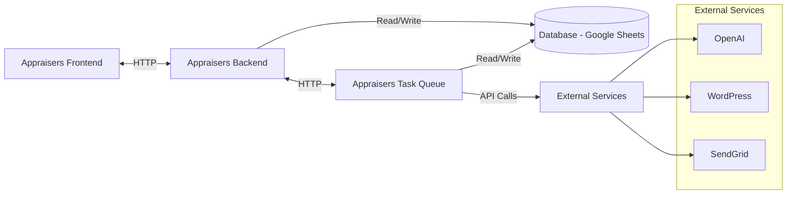
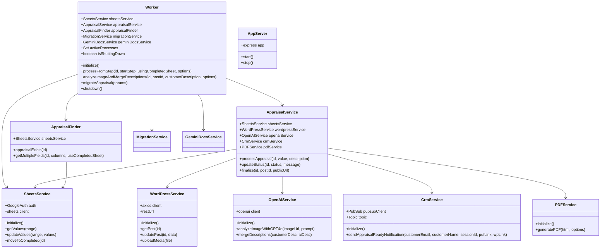
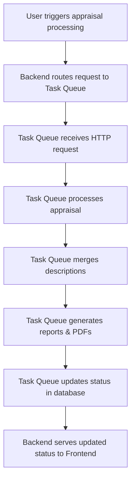
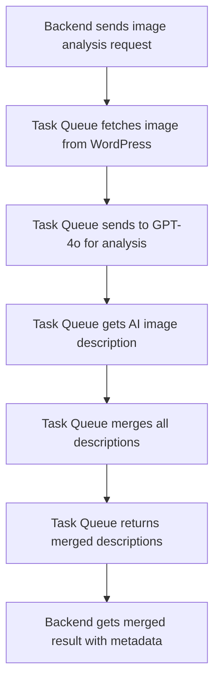

# Appraisers Task Queue Service

A microservice responsible for processing appraisal tasks asynchronously through direct service calls.

## Architecture Overview

The appraisal system follows a microservices architecture with the following components:

1. **Appraisers Frontend**: User interface for customers and administrators
2. **Appraisers Backend**: API gateway and data service
3. **Appraisers Task Queue**: Asynchronous processing service (this repository)

### Service Responsibilities



#### Appraisers Backend Responsibilities
- User authentication and authorization
- Serving data to the frontend
- Routing appraisal processing requests to Task Queue
- Storing and retrieving data from the database
- REST API endpoint management

#### Appraisers Task Queue Responsibilities
- Processing appraisals asynchronously
- Step-by-step orchestration of the appraisal workflow
- Integration with external services (OpenAI, WordPress, etc.)
- File generation (PDF reports)
- Email notifications
- Error handling and retry logic

## API Endpoints

| Endpoint | Method | Description | Request Parameters | Response |
|----------|--------|-------------|-------------------|----------|
| `/health` | GET | Health check endpoint | None | `{ status: "ok", timestamp: "ISO date" }` |
| `/api/docs` | GET | API documentation | None | Documentation object |
| `/api/process-step` | POST | Process an appraisal from a specific step | `id`, `startStep`, `options` | Success/error response |
| `/api/analyze-image-and-merge` | POST | Analyze image and merge descriptions | `id`, `postId`, `description`, `options` | Analysis result |
| `/api/fetch-appraisal/:postId` | GET | Fetch appraisal data from WordPress | `postId` (URL parameter) | Appraisal data |
| `/api/migrate-appraisal` | POST | Migrate existing appraisal to new format | `url`, `sessionId`, `customerEmail`, `options` | Migration data |

### Endpoint Details

#### POST /api/process-step

Processes an appraisal from a specific workflow step.

```json
// Request
{
  "id": "140",                   // Appraisal ID (row in spreadsheet)
  "startStep": "STEP_SET_VALUE", // Step to start processing from
  "options": {                   // Optional parameters
    "appraisalValue": "1500",    // Value for STEP_SET_VALUE
    "description": "Antique oil painting...",
    "appraisalType": "Regular",
    "postId": "145911"           // WordPress post ID
  }
}

// Response
{
  "success": true,
  "message": "Appraisal 140 has been processed from step STEP_SET_VALUE",
  "timestamp": "2025-04-25T09:30:15.123Z"
}
```

#### POST /api/analyze-image-and-merge

Specialized endpoint for AI image analysis and description merging.

```json
// Request
{
  "id": "140",              // Appraisal ID (row in spreadsheet)
  "postId": "145911",       // WordPress post ID with main image
  "description": "...",     // Optional customer description
  "options": {}             // Additional options (optional)
}

// Response
{
  "success": true,
  "message": "Image analyzed and descriptions merged for appraisal 140",
  "data": {
    "appraisalId": "140",
    "postId": "145911",
    "aiImageDescription": "...",
    "customerDescription": "...",
    "mergedDescription": "...",
    "briefTitle": "Oil Painting of Countryside",
    "detailedTitle": "19th Century European Oil Painting of Rural Countryside",
    "metadata": {
      "object_type": "Oil Painting",
      "creator": "Unknown",
      "estimated_age": "Mid-19th Century",
      "medium": "Oil on Canvas",
      "condition_summary": "Good condition with minor craquelure"
    }
  },
  "timestamp": "2025-04-25T09:30:15.123Z"
}
```

#### GET /api/fetch-appraisal/:postId

Fetches appraisal data from WordPress by post ID.

```json
// Response
{
  "success": true,
  "message": "Appraisal data for post 145911 successfully retrieved and logged to console",
  "data": {
    "title": "Antique Oil Painting",
    "type": "Regular",
    "status": "Processing",
    "value": "1500"
  }
}
```

#### POST /api/migrate-appraisal

Migrates an existing appraisal to the new format.

```json
// Request
{
  "url": "https://example.com/appraisal/123",  // Existing appraisal URL
  "sessionId": "user_session_456",             // Current user session
  "customerEmail": "customer@example.com",     // Customer email
  "options": {}                                // Additional options
}

// Response
{
  "success": true,
  "message": "Appraisal migration data prepared successfully",
  "data": {
    // Migration data...
  },
  "timestamp": "2025-04-25T09:30:15.123Z"
}
```

## Class Structure



## Appraisal Processing Flow

The appraisal processing follows a step-by-step workflow:



### Appraisal Processing Steps

1. **STEP_SET_VALUE**: 
   - Set the appraisal value in column J
   - Store initial description in column K
   - Set appraisal type in column B
   - Update status to "Processing"

2. **STEP_MERGE_DESCRIPTIONS**: 
   - Extract WordPress post ID from URL in column G
   - Retrieve existing description from column K
   - Analyze image using GPT-4o Vision
   - Store AI-generated description in column H
   - Merge customer and AI descriptions
   - Store merged description in column T
   - Store brief title in column S
   - Update WordPress post with new titles
   - Update status to "Ready"

3. **STEP_UPDATE_WORDPRESS**:
   - Fetch appraisal data from columns B, J, and L
   - Update WordPress post with value, description, and type
   - Update status to "Updating"

4. **STEP_GENERATE_VISUALIZATION**:
   - Get WordPress post ID from URL in column G
   - Call WordPress service to generate visualizations
   - Complete the appraisal report on WordPress

5. **STEP_BUILD_REPORT**:
   - Process appraisal with existing data
   - Generate full appraisal report

6. **STEP_GENERATE_PDF**:
   - Create PDF version of the appraisal
   - Get public permalink from WordPress
   - Send email notification to customer
   - Update appraisal status to "Completed"

## Image Analysis and Description Merging

A specialized flow for AI image analysis and description merging:



## Environment Variables and Secrets

The service uses Google Secret Manager to securely access credentials and configuration:

| Secret Name | Description | Used By |
|-------------|-------------|---------|
| `PENDING_APPRAISALS_SPREADSHEET_ID` | Google Sheets ID for pending appraisals | SheetsService |
| `COMPLETED_APPRAISALS_SPREADSHEET_ID` | Google Sheets ID for completed appraisals | SheetsService |
| `OPENAI_API_KEY` | API key for OpenAI services | OpenAIService |
| `WORDPRESS_API_URL` | WordPress API endpoint URL | WordPressService |
| `WORDPRESS_USERNAME` | WordPress API username | WordPressService |
| `WORDPRESS_PASSWORD` | WordPress API password | WordPressService |
| `SENDGRID_API_KEY` | SendGrid API key for email sending | EmailService |
| `SENDGRID_FROM_EMAIL` | Email address used as sender | EmailService |

## File Structure

```
appraisers-task-queue/
├── src/
│   ├── app.js                   # Main Express application
│   ├── worker.js                # Core processing worker
│   ├── processor.js             # Processing orchestration
│   ├── local-app.js             # Local development server
│   ├── services/
│   │   ├── appraisal.service.js # Appraisal processing logic
│   │   ├── sheets.service.js    # Google Sheets integration
│   │   ├── wordpress.service.js # WordPress API integration
│   │   ├── openai.service.js    # OpenAI API integration
│   │   ├── email.service.js     # Email sending via SendGrid
│   │   ├── pdf.service.js       # PDF generation service
│   │   ├── gemini.service.js    # Google Gemini AI integration
│   │   ├── gemini-docs.service.js # Gemini for document processing
│   │   ├── google-docs.service.js # Google Docs integration
│   │   ├── migration.service.js # Migration utilities
│   │   ├── content-extraction.service.js # Content extraction tools
│   │   └── taskQueueService.js  # Task queue management
│   ├── utils/
│   │   ├── logger.js            # Logging utilities
│   │   ├── secrets.js           # Secret Manager integration
│   │   ├── appraisal-finder.js  # Appraisal lookup utilities
│   │   ├── template-loader.js   # Handlebars template loading
│   │   └── local-dev.js         # Local development utilities
│   └── templates/               # Handlebars templates for reports
├── scripts/                     # Build and testing scripts
├── Dockerfile                   # Container definition
├── cloudbuild.yaml              # Google Cloud Build configuration
├── package.json                 # Dependencies and scripts
└── README.md                    # Project documentation
```

## Development

### Prerequisites

- Node.js 20+
- Google Cloud SDK
- Access to Google Secret Manager

### Environment Setup

The following environment variables need to be available through Google Secret Manager for production deployment:

- `PENDING_APPRAISALS_SPREADSHEET_ID`
- `COMPLETED_APPRAISALS_SPREADSHEET_ID`
- `OPENAI_API_KEY`
- `WORDPRESS_API_URL`
- `WORDPRESS_USERNAME`
- `WORDPRESS_PASSWORD`
- `SENDGRID_API_KEY`
- `SENDGRID_FROM_EMAIL`

### Running Locally

```bash
# Install dependencies
npm install

# Start local development server
npm run start:local
```

### Running Tests

```bash
# Test appraisal document generation
npm run test-doc

# Test Gemini document handling
npm run test-gemini-doc
```

### Deployment

The service is deployed to Google Cloud Run using Cloud Build:

```bash
# Deploy via Cloud Build
gcloud builds submit --config cloudbuild.yaml
```

The deployment:
1. Builds a Docker container based on Node.js 20
2. Pushes the image to Google Container Registry
3. Deploys to Cloud Run with public access

## Error Handling

Errors during processing are:
1. Logged with detailed information
2. Updated in the Google Sheets status column
3. Returned in the HTTP response

All processing steps are wrapped in try/catch blocks with specific error handling for each step.

## Monitoring and Logging

The service includes structured logging for all operations:

- Log levels: DEBUG, INFO, WARN, ERROR
- Log context: component name, appraisal ID, process step
- Error details: error message, stack trace, relevant data

Logs are available in Google Cloud Logging with proper filtering by severity and component.

## Graceful Shutdown

The service implements graceful shutdown:
1. Captures SIGTERM and SIGINT signals
2. Waits for in-progress tasks to complete (up to 60 seconds)
3. Forcibly terminates if tasks don't complete in time
4. Logs shutdown status

## Core Components

### Services

#### CrmService
Handles sending notifications to the CRM system when appraisals are completed.

- Connects to Google Cloud Pub/Sub to publish notification messages
- Uses a standardized message format required by the CRM
- Handles error recovery and logging for notification delivery

## Required Environment Variables

| Variable Name | Description |
|---------------|-------------|
| PENDING_APPRAISALS_SPREADSHEET_ID | ID of Google Sheet containing appraisal data |
| WORDPRESS_REST_URL | URL to the WordPress REST API |
| WORDPRESS_APPLICATION_PASSWORD | Authentication credentials for WordPress API |
| OPENAI_API_KEY | API key for OpenAI services |
| GOOGLE_CLOUD_PROJECT | GCP project ID for Pub/Sub |
| PUBSUB_TOPIC_CRM_MESSAGES | Pub/Sub topic name for CRM notifications |